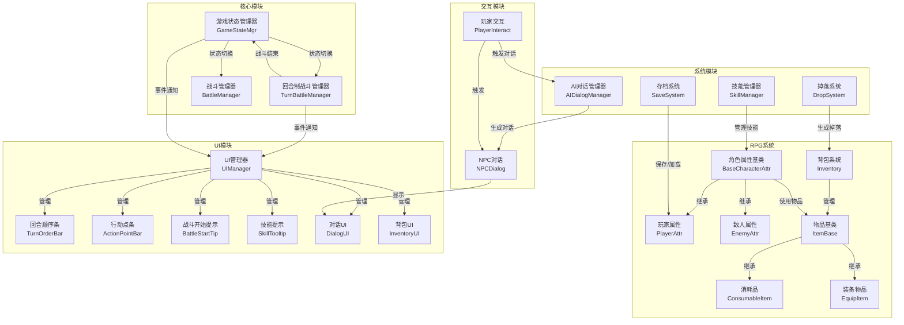
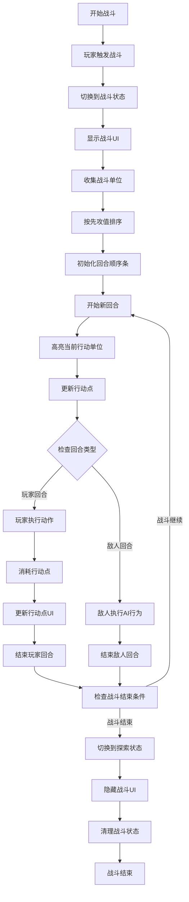
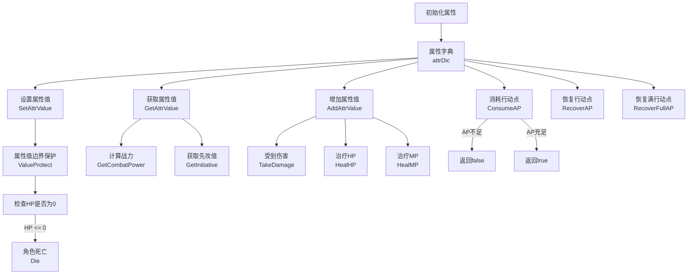
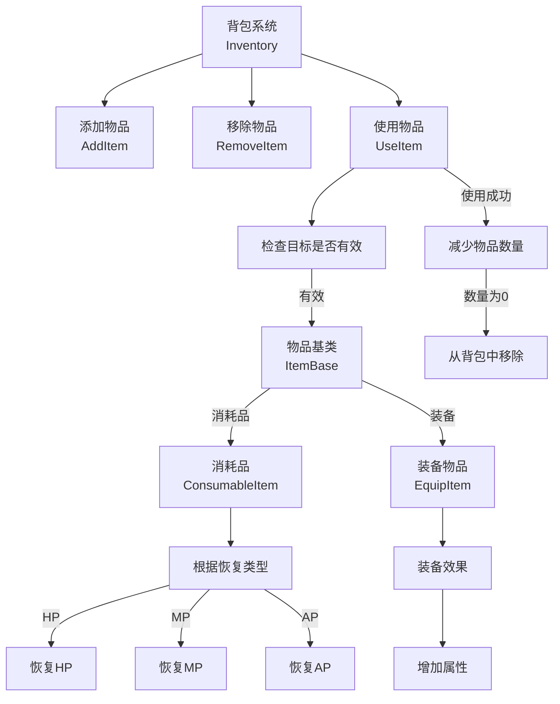
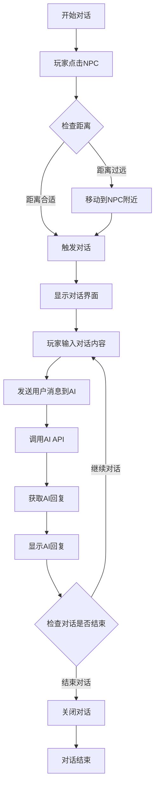
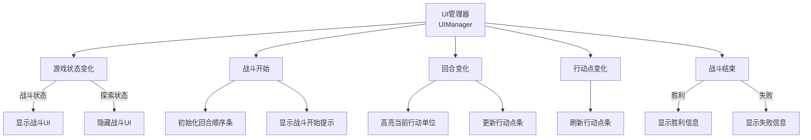
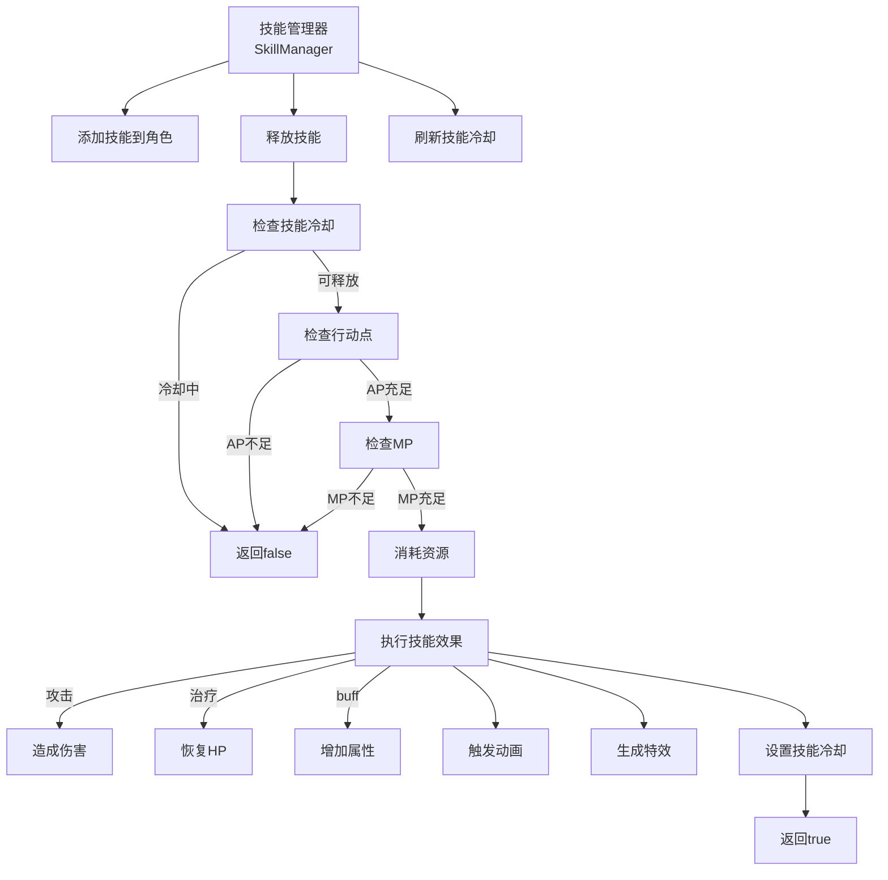
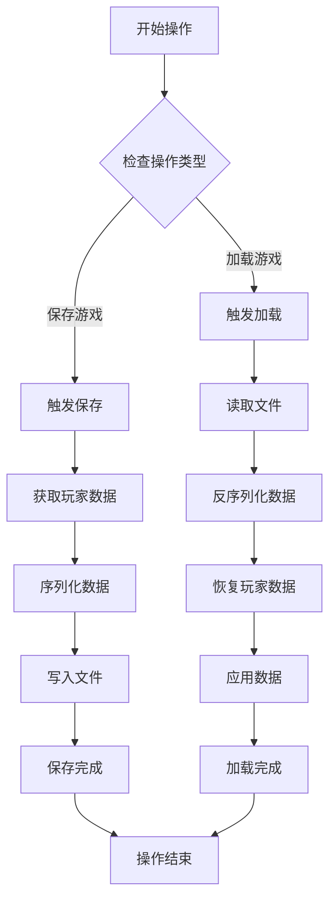

# Unity回合制RPG游戏模块流程图

## 1. 整体架构图

**解释**：
- **核心模块**：负责游戏状态管理和战斗流程控制
- **RPG系统**：包含角色属性管理和物品系统
- **系统模块**：提供技能、对话、存档等功能
- **UI模块**：处理各种界面显示和交互
- **交互模块**：处理玩家与NPC的交互

## 2. 战斗系统流程图

**解释**：
1. 战斗开始时，系统会收集所有战斗单位并按先攻值排序
2. 每个回合按照排序顺序依次行动
3. 玩家回合可以执行移动、攻击、使用技能等操作
4. 敌人回合由AI自动执行行为
5. 每回合结束后检查战斗结束条件
6. 战斗结束后切换回探索状态

## 3. 角色属性系统流程图

**解释**：
- 属性系统使用字典存储所有属性值
- 提供设置、获取、增加属性值的方法
- 包含属性值边界保护，确保属性在合理范围内
- 实现了伤害计算、治疗、行动点管理等核心功能
- 当HP为0时触发角色死亡

## 4. 物品系统流程图

**解释**：
- 背包系统管理物品的添加、移除和使用
- 物品分为消耗品和装备两大类
- 消耗品可以恢复HP、MP或AP
- 装备可以增加角色属性
- 使用消耗品后会减少数量，数量为0时从背包中移除

## 5. 对话系统流程图

**解释**：
1. 玩家点击NPC触发交互
2. 系统检查距离，如果过远会自动移动到NPC附近
3. 打开对话界面，显示NPC的初始对话
4. 玩家输入消息，系统调用AI API获取回复
5. 显示AI回复，继续对话循环
6. 玩家可以随时结束对话

## 6. UI系统流程图

**解释**：
- UI管理器监听游戏状态变化和战斗事件
- 当游戏状态切换到战斗时，显示战斗相关UI
- 战斗开始时初始化回合顺序条和显示战斗提示
- 回合变化时高亮当前行动单位并更新行动点条
- 行动点变化时刷新行动点条
- 战斗结束时显示胜利或失败信息

## 7. 技能系统流程图

**解释**：
- 技能管理器负责技能的添加、释放和冷却管理
- 释放技能时需要检查冷却时间、行动点和MP是否充足
- 技能效果分为攻击、治疗和buff三种类型
- 释放技能后会触发动画和特效
- 技能释放成功后会设置冷却时间

## 8. 存档系统流程图

**解释**：
- 存档系统负责保存和加载游戏数据
- 保存时获取玩家的属性数据并序列化写入文件
- 加载时读取文件并反序列化数据，恢复到玩家属性中

## 总结

本项目是一个回合制RPG游戏，包含以下核心系统：

1. **战斗系统**：回合制战斗，基于先攻值排序，支持行动点管理
2. **属性系统**：灵活的属性管理，支持各种属性操作和边界保护
3. **物品系统**：支持消耗品和装备，具有不同的使用效果
4. **对话系统**：支持与NPC的对话，使用AI生成回复
5. **UI系统**：响应游戏状态变化，提供直观的战斗和探索界面
6. **技能系统**：支持各种技能类型，具有冷却和资源消耗机制
7. **存档系统**：保存和加载游戏进度

这些系统相互配合，构成了一个完整的回合制RPG游戏框架。